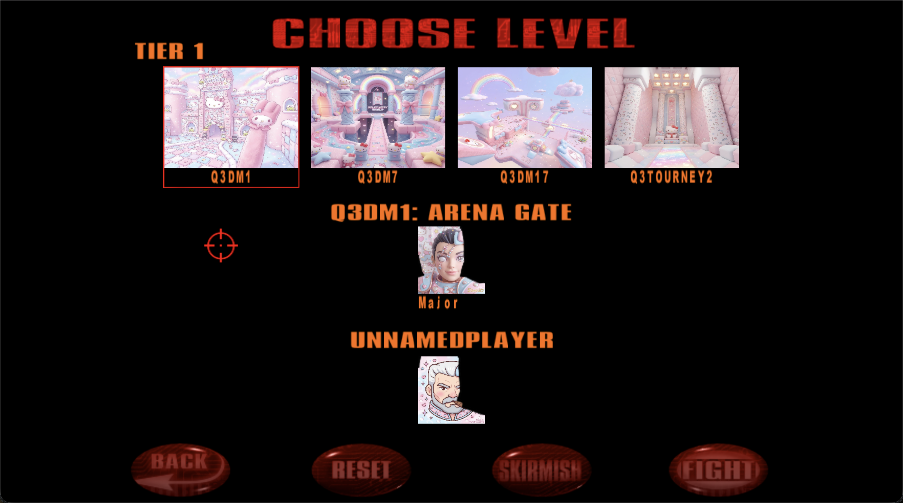

# Quake III Arena — AI-Upscaled

[**Play in browser**](https://mikekovetsky.github.io/quake3-ai/Quake3.htm?demo)

AI-upscaled Quake III Arena running in the browser. Uses [Dawnlight](https://github.com/MikeKovetsky/dawnlight) texture upscaling pipeline powered by fal.ai to transform classic Q3 textures from 64-256px to 1024px+.

Each remaster takes about 40 minutes to generate.

Based on [lrusso/Quake3](https://github.com/lrusso/Quake3) browser port.

## Texture Modes

| Mode | Description |
| :--- | :---------- |
| **Original** | Classic Q3 textures (64-256px) |
| **AI Upscaled** | Faithful upscale to 1024px |
| **Photorealistic** | Real stone, metal, dirt |
| **Hello Kitty** | Kawaii Sanrio makeover |

## Screenshots

### Photorealistic


### Hello Kitty




## Running locally

```bash
python3 -m http.server 8080
# Open http://localhost:8080/Quake3.htm?demo
```
